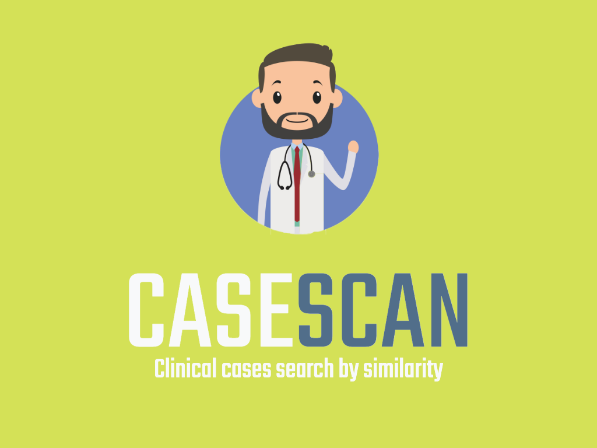
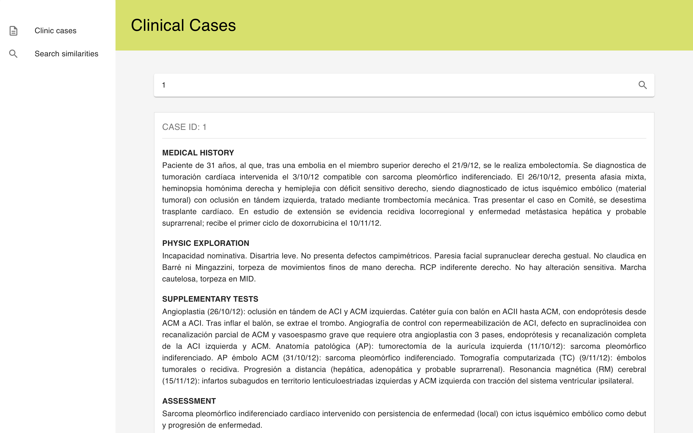
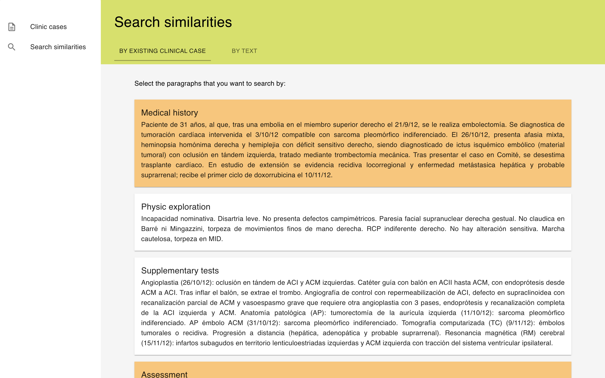
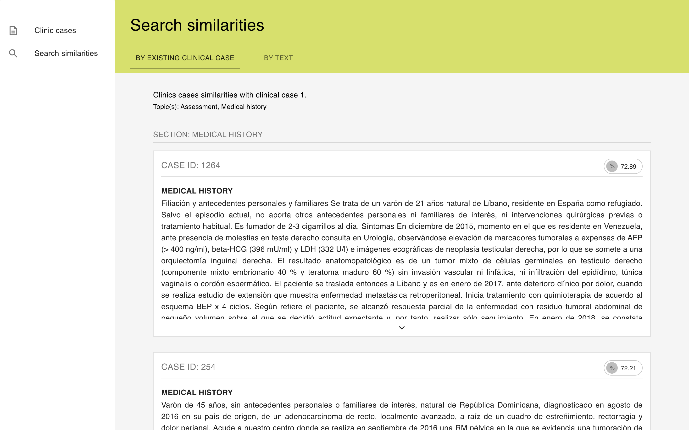
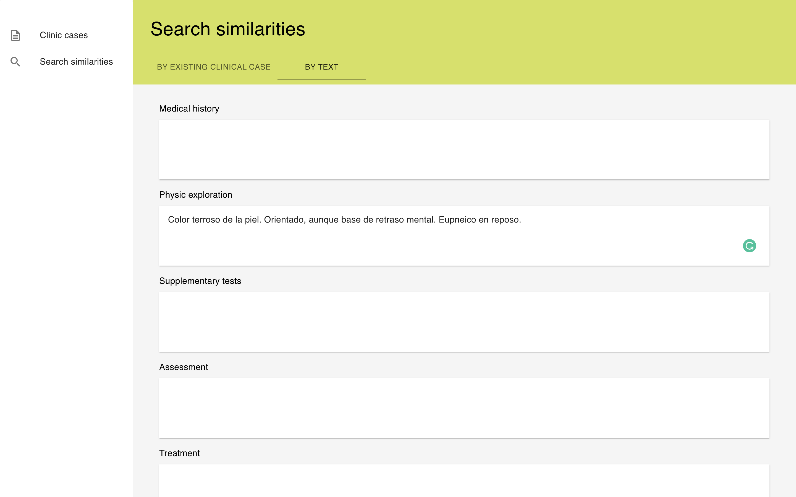
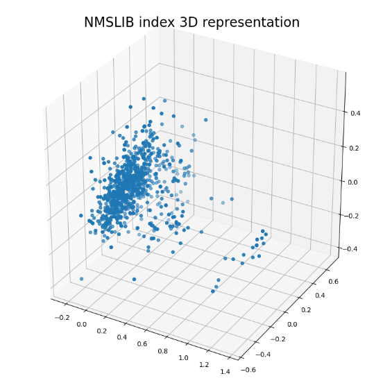

<br>
<p align="center">
  
</p>
<br>


[](http://hits.dwyl.io/AlbertSuarez/casescan)
[](https://gitHub.com/AlbertSuarez/casescan/stargazers/)
[](https://gitHub.com/AlbertSuarez/casescan/network/)
[](https://github.com/AlbertSuarez/casescan)
[](https://gitHub.com/AlbertSuarez/casescan/graphs/contributors/)
[](https://github.com/AlbertSuarez/casescan/blob/master/LICENSE)

[Demo](https://casescan.asuarez.dev) | [API Documentation](https://casescan.herokuapp.com/ui/) | [API Endpoint](https://casescan.herokuapp.com/)

🔍 Clinical cases search by similarity specialized in Covid-19

## Summary

### Inspiration

We both are a very big fans of similarities project and when we saw this challenge, we couldn't lose the opportunity to work into.

Also, we can imagine how unstructured is the data from the clinical cases, so we wanted to collaborate with our help in order to improve the daily work from the field in this topic.

### What it does

**Casescan** is a small web application where you can search into a clinical cases' database based on text-semantic similarities.

Searches can be performed in two different ways:

- Given an existing clinical case from the database and a bunch of sections from it (Medical history, assessment...).
- Given a free-text input split by section.

The output will be a list of the most similar clinical cases based on the query parameters with the corresponding similarity percentage.

### How I built it

From the frontend perspective, Casescan is a React Web application. It's build as a small dashboard designed for professionals in order to be used in a daily basis. The styles from the website are based on the Material UI guidelines.

From the backend perspective, we have a Python API built with Flask/OpenAPI (connected thanks to Connexion library). This API serves all the features that the frontend needs from the clinical cases retrieving to the differnt types of searches.

The procedure of extracting similarities from the given database has been the following: [Similarity analysis procedure](#similarity-analysis-procedure).

### Challenges I ran into

We both kinda had some experience in the NLP world with previous personal and university projects. However, it was a challenge to face again with this topic and understand how we could extract the most value information from the clinical cases texts.

### Accomplishments that I'm proud of

Given the fact that we couldn't work 24/7 in this project during the hackathon time window, we are very proud of the result and how cute/working is the web application.

### What I learned

Similarities is a concept very famous in the industry but still a lot of discover to be found in the future.

### What's next for Casescan

We only tried one model for extracting the text embeddings, so maybe other one work better for this use case. A deep research given this will be the key for improving the solution.

## Images

<br>
<p align="center">
  
</p>
<br>

<br>
<p align="center">
  
</p>
<br>

<br>
<p align="center">
  
</p>
<br>

<br>
<p align="center">
  
</p>
<br>

## Similarity analysis procedure

### Extract data

Firstly, looking at the initial dataset of 2.500 clinical cases, we saw that a big portion of them contained headers during the clinical explanation (Like Assessment, Evolution...). So, given the length of every document, we decided to split every clinical case in different sections, being able then to have shorter fragments of text with more concise information.

We did a first assessment of the different headers that could be found in the dataset, and we decided to group them all in these 6 different sections:

```csv
medical_history,physic_exploration,supplementary_tests,assessment,treatment,evolution
```

Then, using the `extract_data.py` script, we generated a `pickle` file called `db.pkl` where you can find enough structure data to start playing with it. So, given the initial 2.500 clinical cases, we ended up with the following ones:

**Clinical cases extracted**: [1306 - _52.24%_]
```
> medical_history: [1294 - 99.08%]
> physic_exploration: [1282 - 98.16%]
> supplementary_tests: [1285 - 98.39%]
> assessment: [1274 - 97.55%]
> treatment: [1255 - 96.09%]
> evolution: [1289 - 98.7%]
```

So, as it can be seen above, most of the extracted clinical cases have structured section data.

### Encode embeddings

Once we have the `db.pkl` file contains the clinical cases' data, the next step was to extract the meaning of these texts. There are several approaches, but in this scenario we decided to move forward with a transformer.

Firstly we decided to not train our own model, basically for time concerns given that this project is for a hackathons. So, we ended up in research of which is the model that would work better.

We discovered the [sentence-transformers](https://github.com/UKPLab/sentence-transformers) tool, specialized in embedding retrieving from several sentences, as known as paragraphs; exactly what we wanted. Looking at the available pre-trained models in [their documentation](https://www.sbert.net/docs/pretrained_models.html), we finally decided to go for an **Average Word Embeddings Model**, more specifically, going for the 840B version of the GloVe model, the current State-of-the-Art.

This model has an output embeddings size of **300** dimensions. So, given the 6 sections described in the previous step, we created 6 different datasets under an H5 file called `embeddings_full.h5` with the clinical cases text features saved. These 6 datasets has an extra 7 one representing the aggregation of every section, being then a dataset with **1800** dimensions.

```text
> Dataset aggregated: [(1306, 1800)]
> Dataset assessment: [(1274, 300)]
> Dataset evolution: [(1289, 300)]
> Dataset medical_history: [(1294, 300)]
> Dataset physic_exploration: [(1282, 300)]
> Dataset supplementary_tests: [(1285, 300)]
> Dataset treatment: [(1255, 300)]
```

### Build indexes

Given the `embeddings_full.h5` file, the latest step was to create as much as [NMSLIB](https://github.com/nmslib/nmslib) indexes as different sections we had in our data. NMSLIB is a Non-Metric Space Library, used as an efficient similarity search library, and a toolkit for evaluation of k-NN methods for generic non-metric spaces.

Once the indexes created under the `indexes` folder, it's just sending embeddings as input and then getting the closest point in the space with the corresponding distance.

```text
> Index for evolution.nmslib: [1.67 MB]
> Index for supplementary_tests.nmslib: [1.66 MB]
> Index for treatment.nmslib: [1.62 MB]
> Index for assessment.nmslib: [1.65 MB]
> Index for physic_exploration.nmslib: [1.66 MB]
> Index for medical_history.nmslib: [1.67 MB]
> Index for aggregated.nmslib: [9.16 MB]
```

<p align="center">
  
</p>

> Note: Index representation generated with [nmslib-viz](https://github.com/AlbertSuarez/nmslib-viz).

## Development

### Requirements

1. Python 3.7+
2. React 17.0+

### Recommendations

Usage of [virtualenv](https://realpython.com/blog/python/python-virtual-environments-a-primer/) is recommended for API / backend package library / runtime isolation.

### Set up

#### API

To run the commands, please execute the following from the `api` directory:

1. Setup virtual environment.

2. Install dependencies.

  ```bash
  pip3 install -r requirements.lock
  ```

#### Client

To run the commands, please execute the following from the `client` directory:

1. Install dependencies.

  ```bash
  npm install
  ```

### Usage

#### API

To run the commands, please execute the following from the `root` directory:

1. Run API container using docker-compose.

  ```bash
  docker-compose up -d --build
  ```


#### API

To run the commands, please execute the following from the `client` directory:

1. Serve React application.

  ```bash
  npm start
  ```

## Authors

- [Albert Suàrez](https://github.com/AlbertSuarez)
- [Elena Ruiz](https://github.com/elena20ruiz)

## License

MIT © Casescan
